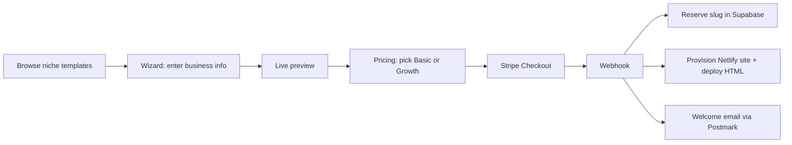

# Platform Builder (dailyclarity.org) — Launch Audit

**Domain intent:** `dailyclarity.org` is correctly serving **Platform Builder** — the site that lets customers pick from 569+ pre-built industry templates, customize, preview, and launch their own business website.

A separate project, **Daily Clarity** (AI thinking assistant), lives at `dailyclarity.netlify.app` and is not what this domain is for.

---

## What’s working today

| Area | Status |
|------|--------|
| **Site live** | Yes — Next.js on Netlify |
| **Template gallery** | Yes — 6 niches, 569+ templates (HVAC, wellness coach, therapist, holistic medicine, aromatherapy, sound bath) |
| **Wizard + preview** | Yes — `/wizard`, `/preview-your-business`, live iframe previews |
| **Supabase** | Connected — slug reservation, portal, contact/leads storage |
| **Stripe API key** | Connected — secret + webhook secret present |
| **Pricing page UI** | Yes — Basic ($20/mo) and Growth ($80/mo) tiers |

---

## What’s broken or incomplete (blocks revenue)

### 1. Stripe checkout does not start

Live test: `POST /api/stripe/checkout` with `planKey: "basic"` returns:

```json
{ "error": "Invalid or missing price configuration." }
```

**Cause:** `STRIPE_PRICE_BASIC` and `STRIPE_PRICE_GROWTH` are not set in Netlify production env (only `STRIPE_SECRET_KEY` is).

**Fix:** In Stripe Dashboard, create two recurring prices ($20/mo and $80/mo), then in Netlify → Site settings → Environment variables add:

- `STRIPE_PRICE_BASIC=price_...`
- `STRIPE_PRICE_GROWTH=price_...`

Redeploy. Confirm webhook URL: `https://dailyclarity.org/api/stripe/webhook` with events `checkout.session.completed`, `customer.subscription.created`.

### 2. Post-purchase provisioning incomplete

| Integration | Status | Impact |
|-------------|--------|--------|
| **NETLIFY_ACCESS_TOKEN** | Missing | After payment, webhook cannot create/deploy customer sites on Netlify |
| **POSTMARK_SERVER_TOKEN** | Missing | Welcome emails and contact notifications won’t send |
| **EMAIL_FROM_ADDRESS** | Missing | Required with Postmark |

Without Netlify token, checkout may succeed but **customer sites won’t auto-launch**.

### 3. Customer template checkout links

Pre-built HTML templates use `{{PRIMARY_CTA_URL}}` placeholders — those get filled at deploy time with the customer’s booking/payment URL, not Platform Builder’s subscription checkout. Platform revenue is from **/pricing** → Stripe subscription for hosting the builder service.

### 4. Portal / test purchase

- `/api/portal/site?slug=...` — works when a site exists in Supabase; errors if table/query fails
- Test purchase API disabled in production (`NEXT_PUBLIC_APP_STAGE=production`) — intentional

---

## Recommended checkout flow (when configured)



Today, step **E** fails (missing price IDs). Steps **H** and **I** fail without Netlify + Postmark env vars.

---

## Netlify env checklist (production)

**Required for paid launch:**

```
STRIPE_SECRET_KEY=sk_live_...
STRIPE_WEBHOOK_SECRET=whsec_...
STRIPE_PRICE_BASIC=price_...
STRIPE_PRICE_GROWTH=price_...
NEXT_PUBLIC_SUPABASE_URL=https://....supabase.co
SUPABASE_SERVICE_ROLE_KEY=...
NEXT_PUBLIC_SUPABASE_ANON_KEY=...
NETLIFY_ACCESS_TOKEN=...
NETLIFY_TEAM_SLUG=...          # if using team sites
PLATFORM_DOMAIN=...            # base domain for customer subdomains
POSTMARK_SERVER_TOKEN=...
EMAIL_FROM_ADDRESS=hello@dailyclarity.org
NEXT_PUBLIC_API_URL=https://dailyclarity.org
```

See `apps/generator-app/.env.example` in the repo for full list.

---

## Quick smoke test after env setup

1. Open https://dailyclarity.org/wellness_coach → pick a template → customize → preview  
2. Go to https://dailyclarity.org/pricing?slug=your-test-slug&niche=wellness_coach&template=...  
3. Click subscribe on Basic — should redirect to Stripe Checkout  
4. Complete test payment (Stripe test mode) — webhook should provision site  
5. Open portal and confirm site record exists  

---

## Separate: Daily Clarity app

If you also run the AI assistant at `dailyclarity.netlify.app`, that repo is `TKHatton/Daily-Clarity` (different product, different Stripe products). Launch fixes for that app are documented separately in the Daily-Clarity repo `LAUNCH_AUDIT.md`.
