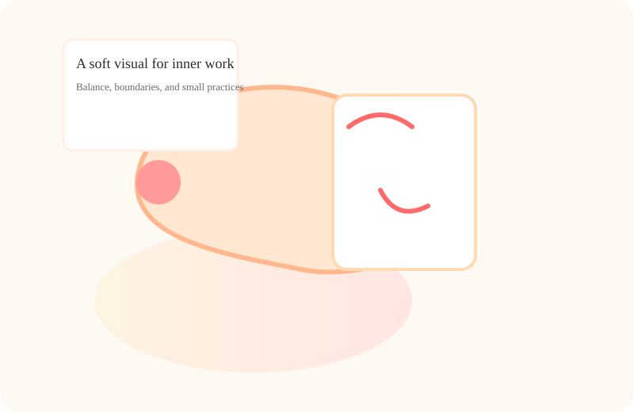

# Contact Page — {{BUSINESS_NAME}}

This bundle contains the contact page for the private practice therapist site and a short README describing structure and customization pointers.

Files included in this chunk
- contact.html — full contact + intake page built in the "bold_playful" layout family. Contains the required sections that ripple across the site: hero, diagnostic, plan, micro_habits, pricing, and CTA.

Design notes
- Layout: bold_playful — bright accent gradients, rounded cards, playful geometry while keeping content calm and professional.
- Accessibility: semantic headings, labeled form fields, ARIA labels for main form and navigation. Colors are high contrast against dark background; adjust variables in :root to tune palette.
- Visuals: the contact page references a local hero visual and expects project-level SVG assets at assets/img/hero.svg, assets/img/avatar.svg, assets/img/pattern.svg. For this chunk the hero is embedded inline to ensure the page renders without external files.

Therapist realism & legal
- Contains confidentiality & privacy note, scope/boundaries language, and a crisis disclaimer. Language avoids medical guarantees and frames support in ethically grounded terms.
- Placeholders included: {{BUSINESS_NAME}}, {{TAGLINE}}, {{PHONE}}, {{EMAIL}}, {{PRIMARY_CTA_LABEL}}, {{PRIMARY_CTA_URL}}, {{THERAPIST_NAME}}, {{LICENSE}}, {{MODALITIES}}, {{CITY}}, {{STATE}}. Replace these with your practice values.

How to customize
1. Replace placeholders globally using a text editor or build script.
2. To change colors or spacing, edit the CSS variables in the :root block near the top of contact.html.
3. If you host SVG assets locally, add unique SVG files at assets/img/hero.svg, assets/img/avatar.svg, and assets/img/pattern.svg. The page uses an inline SVG for the hero; you may swap that for an  if you add the file.
4. Modify program and pricing text directly in the markup to reflect current offerings or different cohort lengths.

Form behavior
- The contact form is a simple client-side demo with minimal validation and a simulated submission message. Hook the form to your backend or form handling service by changing the form's action and method attributes and removing the demo submit handler in the <script> block.

Privacy & compliance reminders
- If you intend to collect protected health information through forms, ensure your hosting, forms, and email are HIPAA-compliant where relevant. This template includes a privacy notice but is not a legal substitution.

Nav consistency
- Navigation labels intentionally vary across templates (Home, About, Specialties, Approach, Invest, FAQ, Book, Connect). Ensure links remain consistent and point to: index.html, about.html, specialties.html, approach.html, fees.html, faq.html, book.html, contact.html.

Notes for developers
- No external fonts or CDNs are used. All styling is inline for portability.
- Keep CSS variables for easy theming. Use the provided class structure to introduce animations or more layout variants if desired.

If you need the other pages in this cohort bundle (index, about, specialties, approach, fees, faq, book), request the next chunk and I will generate them matched to the visual system and placeholders used here.